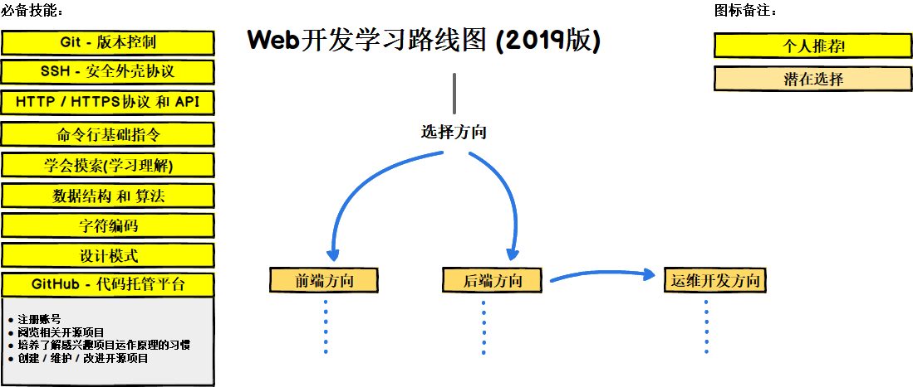

> Web开发者学习路线图 (2019版)

以下路线图主要展示了成为前端开发者、后端开发者或运维开发者的技术学习路线。本项目源于我为一位老教授制作的、用于跟学生们分享和交流观点的学习路线图。

如果您认为本项目还有可以改进的地方，还请多多指教、献计献策。

***

<b> 🎉 我们正在研究这些路线图的更简洁的版本 🎉 </b> 关注 <a href="http://roadmap.sh">roadmap.sh</a> 了解更多细节!

***

> 这些路线图的目的是让您了解全局，并指导您如果您对接下来要学习的内容感到困惑，而不是鼓励您选择时髦和时尚的东西。你应该逐渐理解为什么一种工具比另一种工具更适合某些情况，并记住时髦和时尚从来不是最适合这项工作。

## 🚀 介绍

## 🎨 前端学习路线图

总的来讲，前端学习曲线是个先易后难的过程，其主要职能就是把网站的界面更好地呈现给用户。这就要求前端工程师涵盖的知识面非常广，既有具体的技术，又有抽象的理念，是一项特殊的工作。

## 👽 后端学习路线图

对于后端方向，我个人更青睐于将 Node.js 和 PHP 7 作为主要技术栈。最近我还尝试了 Go 语言，很是喜欢。若要除去这些再选一门语言，我会给 Python 投上一票。不过这只是本人的一家之辞，您大可以选用图中的任意一种语言。  

## 👷 运维开发学习路线图

## 🚦 结语

如果您觉得路线图存在可以改进的地方，请**修改内容**后**创建 Issue**，并**提交合并请求**(Pull Request)。与此同时，我也在持续改进本项目，因此您可能要对本仓库(Repository)进行**持续关注**(Watch)或打上**星标标记**(Star)。

## ☑ 待办事项

- [x] 添加前端学习路线图
- [x] 添加后端学习路线图
- [x] 添加运维开发学习路线图
- [ ] 添加路线图相关资源

## 👬 投稿/协作

本项目路线图基于 [Balsamiq](https://balsamiq.com/products/mockups/) 生成，路线图文件位于 `/project-files` 目录下。若需进行修改，请运行 Balsamiq 后，点选 **Project > Import > Mockup JSON**，程序会为您载入对应的路线图数据。接下来，您应依次进行内容修正、文档上传，并更新README文件中的图片超链接等操作，最后提交合并请求(Pull Request)。	

- 附上改进内容，提交合并请求(Pull Request)
- 创建 Issue、讨论交流
 
## 许可协议

